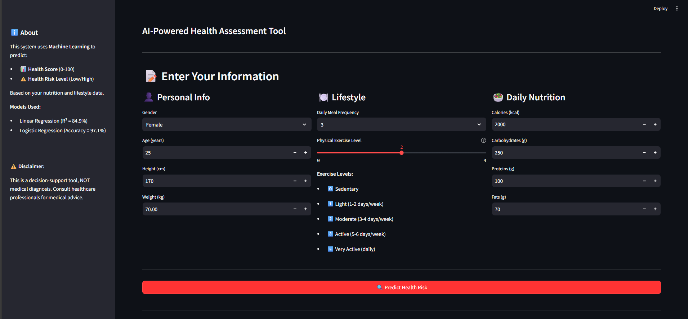

# 🥗 Nutrition-Based Health Risk Prediction System

An end-to-end **Machine Learning + Streamlit** project that predicts a user's **Health Score (0–100)** and **Health Risk Level (Low / High)** based on nutrition, lifestyle, and body metrics.

This project demonstrates **data analysis, ML model training, and real-time prediction** using an interactive web application.

---

## 🚀 Key Features
- 🎯 Predicts **Health Score (0–100)**
- ⚠️ Classifies **Health Risk Level**
- 📊 Interactive **Streamlit Web App**
- 📈 Visual analytics using **Plotly**
- 🧠 Uses BMI, BMR, calories & macronutrients
- 🔄 End-to-end ML pipeline

---

## 🧠 Machine Learning Models Used

| Model | Purpose | Performance |
|-----|-------|------------|
| Linear Regression | Health Score Prediction | R² ≈ 84.9% |
| Logistic Regression | Health Risk Classification | Accuracy ≈ 97.1% |

---

## 📊 Input Parameters
- Gender
- Age
- Height & Weight
- Daily meal frequency
- Physical activity level
- Calories intake
- Macronutrients (Carbs, Proteins, Fats)

---

## 🛠️ Tech Stack
- **Python**
- **Pandas, NumPy**
- **Scikit-learn**
- **Streamlit**
- **Plotly**
- **Joblib**

---

## 📁 Project Structure
```bash
nutrition_health_risk/
│
├── app/
│ └── app.py # Streamlit application
│
├── notebooks/
│ ├── 01_eda.ipynb # Exploratory Data Analysis
│ └── model_training.ipynb # Model training & evaluation
│
├── models/
│ ├── linear_regression_model.pkl
│ ├── logistic_regression_model.pkl
│ ├── scaler.pkl
│ ├── scaler_logistic.pkl
│ └── feature_info.pkl
│
├── data/ # Dataset (optional)
│
├── assets/
│ └── screenshots/ # App screenshots
│
├── requirements.txt
├── .gitignore
└── README.md

```
## ▶️ How to Run the Project Locally

### 1. Clone the Repository
```bash
git clone https://github.com/your-username/nutrition_health_risk.git
cd nutrition_health_risk
```
2.Install Dependencies
```bash
pip install -r requirements.txt
```
3.Run the Streamlit App
```bash
streamlit run app/app.py


```
##Screenshots
```bash
 


```
## 👩‍💻 Author
**Meghana S**  
Final-year AIML Student  
Interested in AI, Machine Learning & Computer Vision
