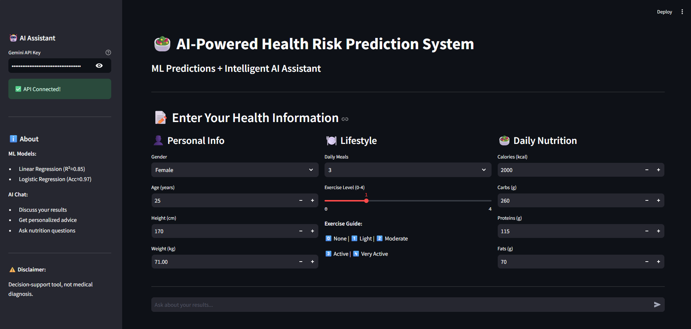
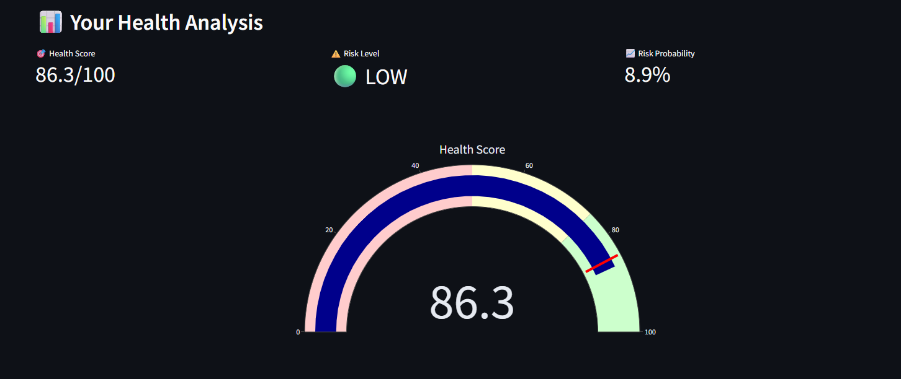
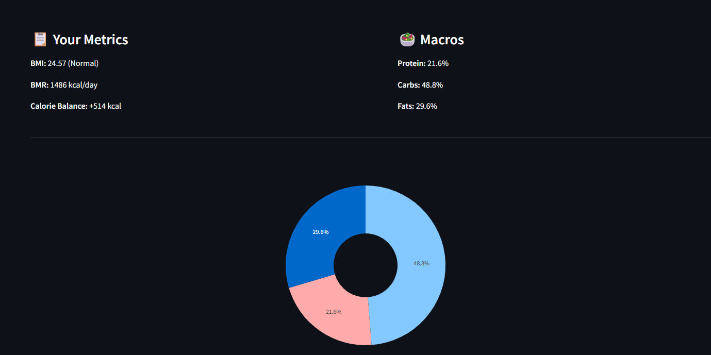
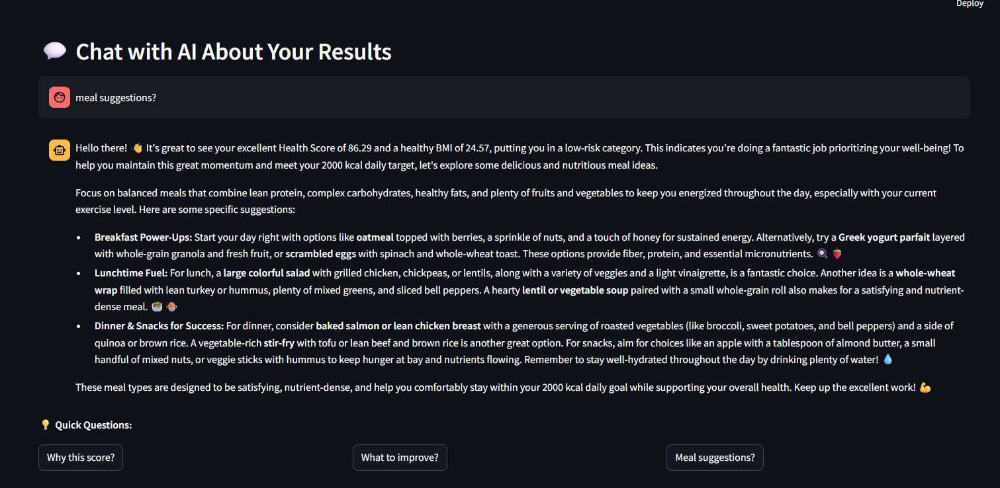

# AI-Powered Nutrition Health Risk Prediction System
> Machine Learning + AI-powered health assessment system with intelligent conversational assistant for personalized nutrition guidance.

An end-to-end Machine Learning + AI project that predicts a user's **Health Score (0–100)** and **Health Risk Level (Low / High)** based on nutrition, lifestyle, and body metrics. Enhanced with **Google Gemini AI** for interactive health coaching and personalized recommendations.

---

##  Key Features

###  AI-Powered Chat Assistant
- Conversational health advisor using Google Gemini API
- Context-aware responses based on user's health data
- Personalized meal planning and nutrition recommendations
- Interactive Q&A about prediction results
- Suggested quick questions for instant guidance

###  Machine Learning Core
- Predicts Health Score (0–100) using Linear Regression
- Classifies Health Risk Level (Low/High) using Logistic Regression
- Interactive Streamlit web application with real-time predictions
- Visual analytics using Plotly (gauges, charts, pie charts)
- Uses BMI, BMR, calories, and macronutrients
- Complete end-to-end ML pipeline from data to deployment

---

##  Model Performance

| Model | Purpose | Performance |
|-------|---------|-------------|
| **Linear Regression** | Health Score Prediction | R² = 0.849 |
| | MAE | 3.78 |
| | RMSE | 4.64 |
| **Logistic Regression** | Health Risk Classification | Accuracy = 97.1% |
| | Precision | 95.8% |
| | Recall | 98.6% |
| | F1-Score | 97.2% |

**Dataset:** 2,098 user profiles  
**Risk Distribution:** Balanced 50/50 split

---

##  Input Parameters

### Personal Information
- Gender
- Age
- Height and Weight

### Lifestyle
- Daily meal frequency
- Physical activity level (0-4 scale)

### Nutrition
- Daily calorie intake
- Macronutrients (Carbohydrates, Proteins, Fats)

### Auto-Calculated Metrics
- BMI (Body Mass Index)
- BMR (Basal Metabolic Rate)
- Calorie Balance
- Macro Ratios

---

##  Tech Stack

### Machine Learning
- Python 3.12
- Pandas
- NumPy
- Scikit-learn
- Joblib

### AI / LLM
- Google Gemini API
- google-genai package

### Web Framework & Visualization
- Streamlit
- Plotly
- Matplotlib
- Seaborn

---

##  Project Structure

```bash
nutrition_health_risk/
│
├── app/
│ └── app.py
│
├── llm/
│ ├── init.py
│ └── llm_assistant.py
│
├── notebooks/
│ ├── exploration.ipynb
│ ├── note.ipynb
│
├── models/
│ ├── linear_regression_model.pkl
│ ├── logistic_regression_model.pkl
│ ├── scaler.pkl
│ ├── scaler_logistic.pkl
│ └── feature_info.pkl
│
├── data/
│ ├── user_nutritional_data.csv
│ └── processed_nutritional_data.csv
│
├── assets/
│ └── screenshots/
│
├── requirements.txt
├── .gitignore
└── README.md
```

---

##  Installation and Setup

### Step 1: Clone the Repository

```bash
git clone https://github.com/your-username/nutrition_health_risk.git
cd nutrition_health_risk
```
### Step 2: Install Dependencies
```bash
pip install -r requirements.txt
```

### Step 3: Train Models (First Time Only)
```bash
jupyter notebook notebooks/note.ipynb
```
### Step 4: Get Gemini API Key (Free)
```bash
Visit: https://aistudio.google.com/app/apikey

Click "Create API Key"

Copy your API key
```
### Step 5: Run the Application
```bash
streamlit run app/app.py
```

## AI Chat Features

-The integrated AI assistant provides:
-Result explanation
-Metric analysis
-Personalized food recommendations
-Custom meal planning
-Improvement guidance
-Comparative health analysis

 ## ⚙ How It Works

### Feature Engineering

The Health Score is calculated based on:

- BMI (Optimal range: 18.5–24.9)
- Calorie Balance
- Protein Ratio (15–30%)
- Fat Ratio (20–35%)
- Exercise Level
- Meal Frequency

### Model Training Process

1. Data preprocessing  
2. Feature scaling  
3. Linear Regression (Health Score prediction)  
4. Logistic Regression (Risk classification)  
5. 80/20 stratified train-test split  

### AI Integration

- Uses Google Gemini API  
- Context-aware prompts with user health data  
- Real-time chat interface  

---

##  Future Enhancements

- SHAP explainability  
- Support for multiple LLM providers  
- User authentication and data persistence  
- Streamlit Cloud deployment  
- Food image recognition  
- Integration with fitness tracking devices  

---

## ⚠ Disclaimer

This project is for **educational and informational purposes only**.  
It is **NOT** a substitute for professional medical advice.

---
##  Application Screenshots

###  Home Page


###  Prediction Results


###  Visual Analytics


### AI chat interface



If you find this project useful, consider giving it a star on GitHub!
##  Author
**Meghana S**  
Final-year AIML Student  
Interested in AI, Machine Learning & Computer Vision


